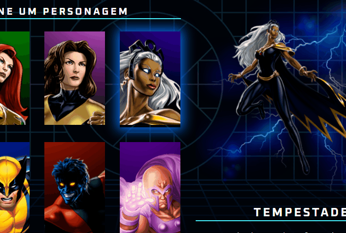

# X-Men 

Este foi o projeto que tive o primeiro contato com códigos e esse mundo da programação, nesse projeto utilizei as tecnologias:

- JS
- CSS3
- HTML5

## Meu objetivo 
Fazer uma seção dinâmica de seleção de personagens com temática X-Men

[ 
]

###Como Utilizar

Clone o projeto 
```
git clone (cole https://github.com/EliasMos/x-men.git) 
```  

Acesse a pasta do projeto 

``` 
cd x-men 
```